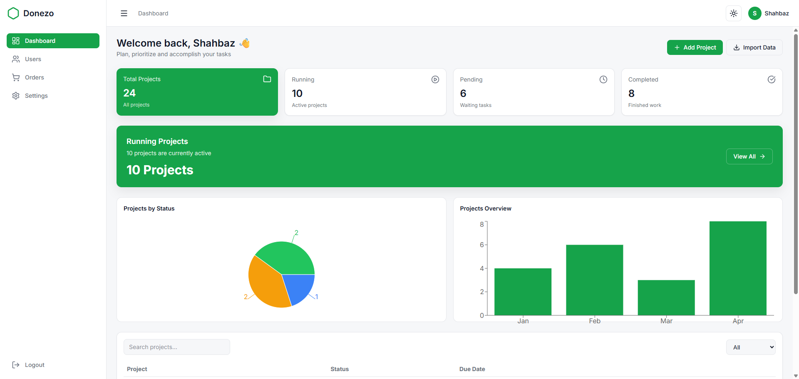

# 🚀 Dashboard UI (Admin Panel)

A modern, responsive **Admin Dashboard** built with **React + Vite + Tailwind CSS v4**.
This project demonstrates real-world frontend architecture including CRUD operations, charts, reusable components, and dark/light theme support.

---

## 🌐 Live Demo

👉 [View Live Demo](https://dashboard-ui.vercel.app)

---

## 📸 Screenshots

> 

---

## ✨ Features

### 📊 Dashboard

- Stats overview cards
- Highlight section
- Recent projects table
- Charts (Recharts)
- Search, filter, pagination

### 👤 Users Management

- Add / Edit / Delete users
- Search users
- Modal-based forms

### 📦 Orders Management

- Orders table with status badges
- Search + filter
- Clean data representation

### ⚙️ Settings

- Profile update
- Password change
- Theme toggle (Dark / Light)
- Preferences

---

## 🧩 Tech Stack

- **React (Vite)**
- **Tailwind CSS v4**
- **Recharts (Charts)**
- **React Router DOM**
- **Lucide Icons**

---

## 🎨 UI Features

- Dark / Light mode (persistent)
- Responsive design (mobile + desktop)
- Reusable components (Table, Modal, Button)
- Clean design system using CSS variables

---

## 🧠 Key Concepts Implemented

- State lifting & prop drilling
- Reusable UI components
- CRUD operations (Create, Read, Update, Delete)
- Data formatting (ISO → UI)
- Modular folder structure
- Responsive layouts

---

## 📁 Folder Structure

```
src/
  components/
    dashboard/
    users/
    orders/
    settings/
    ui/
  pages/
    Dashboard.jsx
    Users.jsx
    Orders.jsx
    Settings.jsx
  layout/
  routes/
  utils/
  api/
```

---

## ⚙️ Installation

```bash
git clone https://github.com/Shahbaz7307/dashboard-ui.git
cd dashboard-ui
npm install
npm run dev
```

---

## 🚀 Deployment

Recommended: **Vercel**

```bash
npm run build
```

---

## 📌 Future Improvements

- Authentication system (Login/Register)
- API integration (real backend)
- Role-based access control
- Advanced charts & analytics
- Toast notifications
- Export / import data

---

## 👨‍💻 Author

**Shahbaz Shabbir Malik**

- LinkedIn: https://www.linkedin.com/in/shahbaz-shabbir-malik
- GitHub: https://github.com/Shahbaz7307

---

## ⭐ Support

If you like this project, give it a ⭐ on GitHub!
